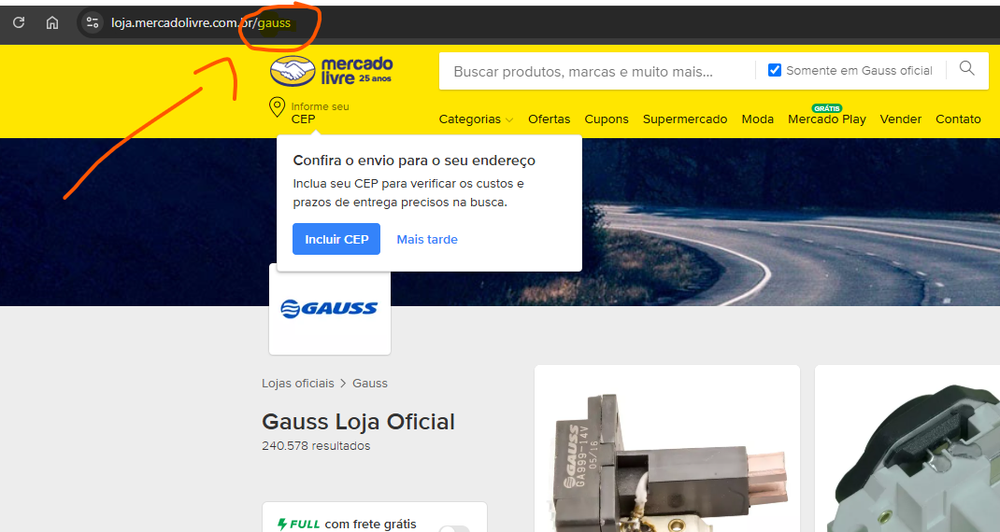

# Uso

1. Pegar informações de uma determinada loja oficial. Passar por uma conferência de **[CORRESPONDÊNCIAS]**, onde o usuário vai apontar se deve ou não clonar tal produto.

    1.1 Identificao da loja oficial.
    

    1.2 Identificando o nome referente a loja oficial
    

    ```bash
    py ./main.py
    ```

2. Com a lista de correspondências pronta, agora é passar por uma validação de fotos. O programa baixa as fotos de todos os anúncios apontados para clonagem, depois abrirá um **[APLICATIVO]** apontando tal foto e o usuário decidirá qual foto deve ir ou não para o anúncio.

    ```bash
    py ./photo_validation/get_photo_url.py # Baixar fotos
    py ./photo_validation/app.py           # Conferir fotos
    ```

3. Com a lista de correspondências e suas respectivas fotos selecionadas, agora o programa deve **[CLONAR]** os produtos, alterando seus atributos conforme os atributos cadastrados no sistema "SIAC".

    ```bash
    py ./clonagem/main.py  # Modulo principal para clonagem
    ```
