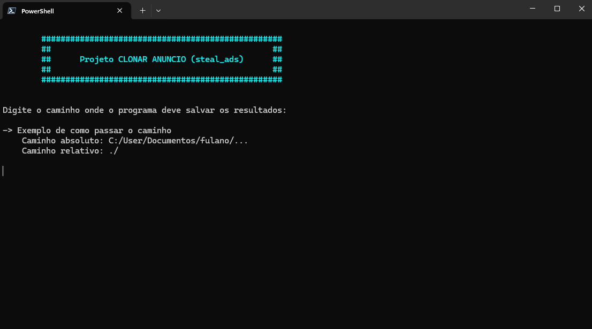
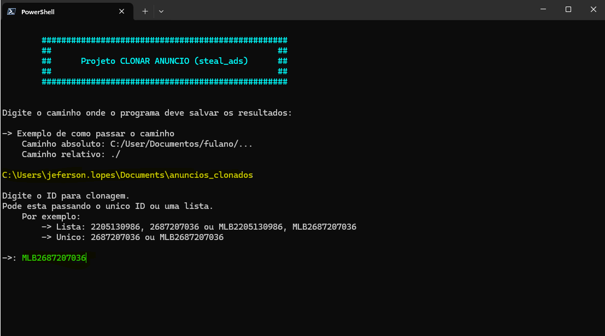
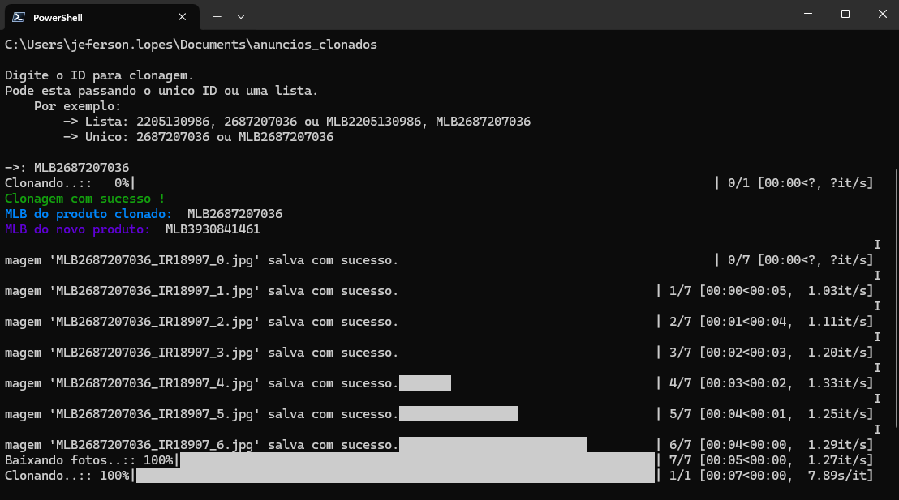

# Steal Ads - Clonador de Anuncios

O Steal Ads é uma ferramenta que permite a clonagem de anúncios do Mercado Livre, copiando todos os atributos de um anúncio específico e criando uma nova publicação na conta do usuário. O usuário apenas precisa fornecer o caminho do diretório onde as informações serão salvas e o código do anúncio (MLB) que deseja clonar.

## Passos para Clonagem

1 - Definir o Diretório de Salvamento

Ao iniciar o script, o usuário será solicitado a inserir o caminho do diretório onde as informações do anúncio serão salvas. O caminho fornecido será usado para armazenar os dados clonados.

Exemplo de caminho:

```makefile
C:\Users\jeferson.lopes\Documents\anuncios_clonados
```



2 - Inserir o Código do Anúncio (MLB)

Em seguida, o usuário deve inserir o código do anúncio (MLB) do Mercado Livre que deseja clonar. O código pode ser inserido de forma individual ou em uma lista de múltiplos códigos.

Exemplo de código MLB:

```makefile
MLB2687207036
```



3 - Processo de Clonagem

O script irá então começar o processo de clonagem. Durante esse processo, ele irá:

* Copiar todos os dados do anúncio original.
* Criar um novo anúncio na conta do usuário com as mesmas características.
* Informar o status do processo, exibindo mensagens detalhadas sobre o andamento da clonagem.

Caso haja algum erro ou imprevisto durante a clonagem, o script fornecerá informações detalhadas sobre o ocorrido, facilitando o diagnóstico.

Ao finalizar o processo, o script exibirá o novo código do anúncio (MLB) criado, bem como o código original (MLB).

Exemplo de mensagem de sucesso:

```yaml
Clonagem realizada com sucesso!
Novo código MLB: MLB1234567890
Código original MLB: MLB2687207036
```



4 - Verificação das Alterações

Após a clonagem, o usuário deve verificar as possíveis alterações ou ajustes definidos pela coordenação do projeto. Isso inclui a análise de preços, descrições e qualquer outro campo que necessite de personalização para que o anúncio esteja de acordo com as diretrizes do projeto.

## Considerações Finais

* O Steal Ads é uma ferramenta poderosa, mas deve ser usada com cautela, sempre respeitando as políticas e diretrizes do Mercado Livre.
* O usuário deve garantir que os anúncios clonados não violem quaisquer regras da plataforma.
* A coordenação do projeto pode definir ajustes adicionais nos anúncios clonados, caso necessário.
