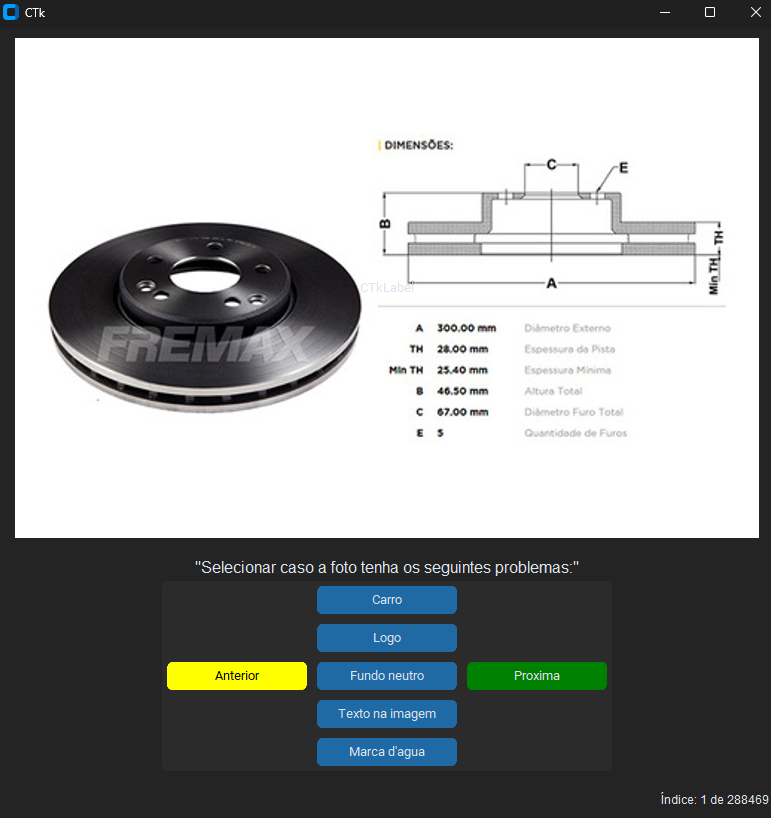

# Validador de Imagens para E-commerce

Este script tem como objetivo catolocar e classificar imagens de produtos do Grupo Bueno. Ele organiza todas as imagens em 4 tabalas diferentes que mostram o local do arquivo, URL ou endereco online, referencia de codigo da peca e as classificacoes de problemas como marca d'água, texto na imagem, fundo neutro, logo, carro na foto e resolucao. A validação é feita através de uma interface gráfica construída com o `customtkinter` e os dados são armazenados em um banco de dados `PostgreSQL`.

## Estrutura Geral

O código é estruturado em uma classe principal chamada `ValidadorImagem`, que possui diversos métodos responsáveis pela leitura de dados, requisição de imagens, interação com a interface gráfica e manipulação de dados em um DataFrame. O fluxo principal é gerido a partir de uma janela Tkinter que permite ao usuário interagir com as imagens e marcar os problemas encontrados.

### Arquivos

    data/
        created_table.sql         # Esquema da criacao de tabela.
    docs/
        assets/
            logo.png              # Logo da pagina.
        index.md                  # Documento da HomePage DOCS.
    app.py                        # Aplicativo de validacao.
    db_ml_fotos_validation.py     # Update/Insert DB.
    mkdocs.yml                    # Configuracao para o DOCS.
    requirements.txt              # Requisitos do projeto.

### Bibliotecas Utilizadas

* `customtkinter`: Para a criação da interface gráfica.
* `requests`: Para requisição de imagens via HTTP.
* `httpx`: Para gerenciamento de requisições HTTP assíncronas.
* `PIL` (Pillow): Para manipulação de imagens.
* `rich`: Para logs e prints coloridos no terminal.
* `pandas`: Para manipulação de DataFrames.
* `Postgres`: Conexão com o banco de dados PostgreSQL.
* `CTkMessagebox`: Para exibição de mensagens na interface.

### Principais Componentes do Código

Atributos da Classe `ValidadorImagem`

* **Colunas padrão**: Definição das colunas do DataFrame que armazenará as informações das imagens.

```python
    __columns_default: list[str] = [
        'marca_produto',
        'nome_arquivo_foto',
        'codigo_referencia',
        'endereco',
        'extensao',
        'extensao_valida',
        'pegar_foto',
        'foto_verificada',
        'marca_dagua',
        'texto',
        'fundo_neutro',
        'logo',
        'carro'
    ]
```

## Processos

Tela de conferência:



Lista de botoes que definem as caracteristicas da imagem:

* `Botão  "Carro"` - Define que a foto possui algum carro.
* `Botão  "Logo"` - Define que a foto possui alguma logomarca.
* `Botão  "Fundo Neutro"` - Define que a foto não possui fundo branco.
* `Botão  "Texto na Imagem"` - Define que a foto possui algum texto.
* `Botão  "Marca D'agua"` - Define que a foto possui marca d'água.

Os botões a seguir determinam se a foto está "OK" ou "NÃO".

Caso o botão ***Próxima*** for selecionado, vai avançar para a próxima imagem e marcar no Banco de Dados as opções selecionadas na lista de botoes anteriores.

Caso o botão ***Anterior*** for selecionado, vai retroceder uma imagem e desmarcar todas as características de imagem.

* `Botão  "Proxima"` - Avance para próxima imagem.
* `Botão  "Anterior"` - Volta uma imagem.

## Exemplo da tabela

| item_id | variation_id | codpro | photo_id | url_foto | foto_valida | foto_verificada | marca_dagua | texto | fundo_neutro | logo | carro | marca_produto | date_last_validation |
|:-------:|:------------:|:------:|:--------:|:--------:|:-----------:|:---------------:|:-----------:|:-----:|:------------:|:----:|:-----:|:-------------:|:--------------------:|
|MLB1532096218|None|041763|999977-MLB41914156453_052020|<http://http2.mlstatic.com/D_999977-MLB41914156453_052020-O.jpg>|True|True|False|False|False|False|False|False|False|
|MLB2097924840|None|041763|999977-MLB41914156453_052020|<http://http2.mlstatic.com/D_999977-MLB41914156453_052020-O.jpg>|False|True|True|False|False|False|False|False|False|
